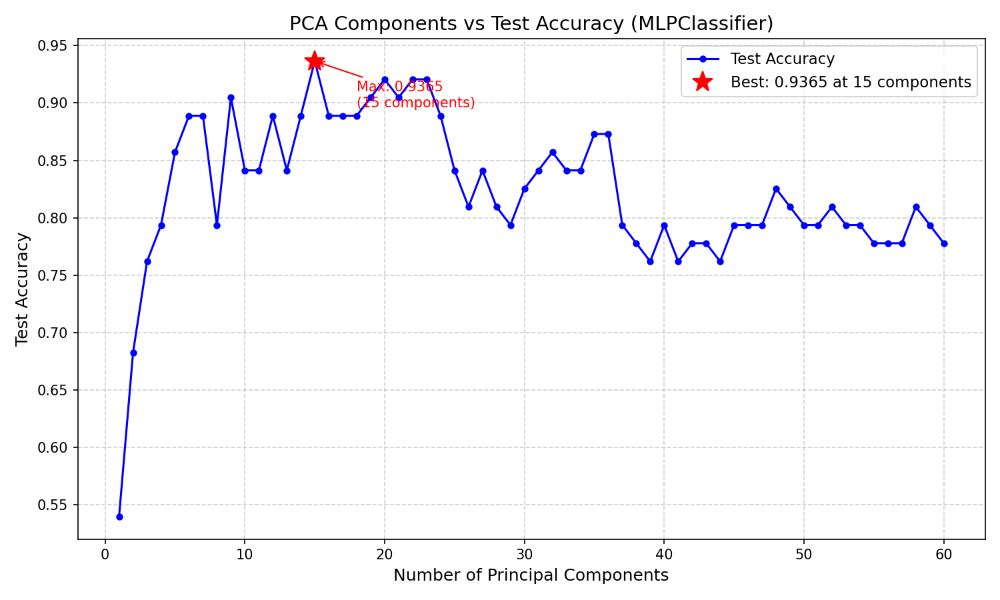

# Sonar Mine vs Rock Classification using PCA + MLPClassifier

Binary classification of sonar returns as either mines or rocks using dimensionality reduction (PCA) followed by a neural network (MLPClassifier). The project sweeps PCA from 1 to 60 principal components to identify the dimensionality that maximizes test accuracy.

---

## Results

| Metric | Value |
|---|---|
| Best test accuracy | 93.65% |
| Optimal PCA components | 15 of 60 |
| Mine recall (sensitivity) | 97.1% (34/35 mines detected) |

**Confusion matrix at 15 components (70/30 train/test split):**

|  | Predicted Rock | Predicted Mine |
|---|---|---|
| **Actual Rock** | 25 (TN) | 3 (FP) |
| **Actual Mine** | 1 (FN) | 34 (TP) |

The single false negative — a mine misclassified as a rock — represents the most dangerous error type in this application.

---

## Accuracy vs Number of PCA Components



---

## Key Findings

Accuracy rises steeply from ~54% at 1 component to a peak of 93.65% at 15 components, then trends downward as more components are added, settling around 78% at all 60 components (no reduction).

The 15-component optimum reflects a signal-to-noise tradeoff: the first ~15 principal components capture the dominant spectral variance that separates mines from rocks, while higher-indexed components increasingly encode sensor noise. Adding those noise dimensions degrades generalization on the test set rather than improving it. Using too few components causes underfitting by discarding discriminative signal before the classifier has enough information to distinguish the two classes reliably.

---

## Tech Stack

- Python 3
- NumPy, Pandas
- scikit-learn — `StandardScaler`, `PCA`, `MLPClassifier`, `confusion_matrix`
- Matplotlib

---

## How to Run

```bash
python3 proj2.py
```

The script expects `sonar_all_data_2.csv` in the same directory. Output includes per-component test accuracy, the maximum accuracy summary, and the confusion matrix. The plot is saved as `accuracy_vs_components.png`.

---

## Dataset

208 sonar observations (97 rocks, 111 mines), each described by 60 frequency-band energy measurements collected by bouncing sonar signals off either a metal cylinder (mine surrogate) or a roughly cylindrical rock. Source: UCI Machine Learning Repository — Connectionist Bench (Sonar, Mines vs. Rocks).
